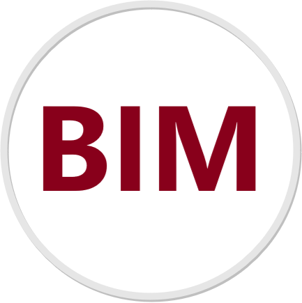
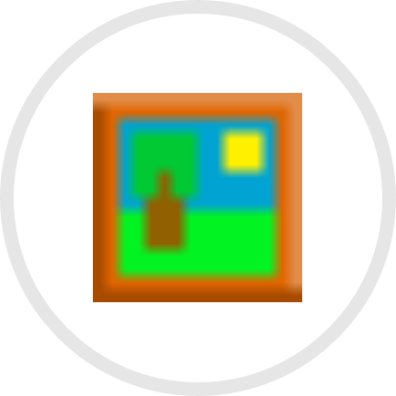

    E-Mail: &nbsp; rebeccasmdt@gmail.com  
    OSM Wiki: <a href="https://wiki.openstreetmap.org/wiki/User:Rebsc" style="color:black">https://wiki.openstreetmap.org/wiki/User:Rebsc</a> 

 

## Projects

   &nbsp;&nbsp;
   &nbsp;&nbsp;
   

